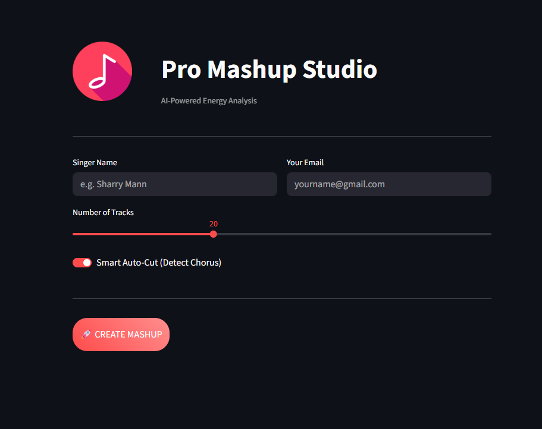

# 🎧 Pro Mashup Studio (102316037)


[](https://share.streamlit.io/)
[](https://www.python.org/)
[](https://ffmpeg.org/)
[](https://opensource.org/licenses/MIT)

> **"Where Code Meets Rhythm."**
> A high-fidelity audio processing engine that automatically downloads, analyzes, cuts, and merges songs into a seamless mashup.

---

## 🌟 Key Features

| Feature | Description |
| :--- | :--- |
| **🧠 Smart AI Analysis** | Uses `Librosa` to detect the "hook" (chorus) of songs automatically, skipping intros/outros. |
| **☁️ Cloud-Ready** | Optimized for Streamlit Cloud with Cookie Authentication to bypass YouTube blocks. |
| **🛡️ Privacy First** | No data storage. Files are processed in ephemeral containers and wiped after use. |
| **📧 Direct Delivery** | Zips the mastered MP3 and emails it directly to your inbox. |

---

## 🚀 How It Works


1.  **Input**: You provide a Singer Name and Number of Tracks.
2.  **Scrape**: The engine hunts down high-quality audio from YouTube (avoiding live/video versions).
3.  **Process**:
    *   **Normalization**: Levels volume across tracks.
    *   **Smart Cut**: Extracts the 30s high-energy segment.
    *   **Crossfade**: Blends tracks with a 1.5s professional fade.
4.  **Delivery**: The final mix is compressed, zipped, and emailed.

---

## 🛠️ Installation & Usage

### 1️⃣ Clone the Studio
```bash
git clone https://github.com/Atishay3825/Assignment_Mashup.git
cd Assignment_Mashup
```

### 2️⃣ Install Dependencies
```bash
pip install -r requirements.txt
```
*(Note: Requires FFmpeg installed on your system path)*

### 3️⃣ Run Locally
```bash
streamlit run 102316037_app.py
```

---

## 🔒 Configuration (Secrets)

To bypass YouTube's "403 Forbidden" block on cloud servers, add your cookies to `.streamlit/secrets.toml`:

```toml
[general]
EMAIL_USER = "your-email@gmail.com"
EMAIL_PASS = "your-app-password"
YOUTUBE_COOKIES = '''
# Netscape HTTP Cookie File
.youtube.com    TRUE    /    FALSE    173...
'''
```

---

## 📸 Screenshots



---

## 👨‍💻 Author

**Name:** Vaibhav Srivastva
**Roll No:** 102316037
**Batch:** 3P12

---

*Built with ❤️ using Python, Streamlit, and Librosa.*


